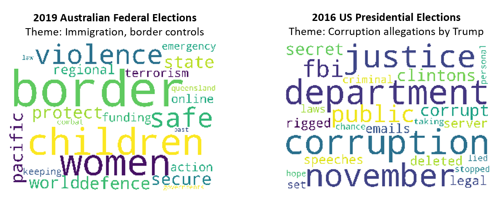

# Investigating the Appeal of Right Wing Politics using LDA Topic Modelling
Recent years have seen right-wing movements gaining traction, particularly in the West. Generally, right-wing politics is associated with nationalism, populism and protectionism. In other words, countries are renouncing the previously-held consensus on the merits of free trade, freedom of mobility and globalisation.  In this project, I attempt to investigate the appeal of right-wing politics. I perform computational text analysis and unsupervised machine learning (LDA topic modeling) on opinion editorials and transcripts of speeches / interviews by right-wing leaders. Specifically, I have chosen 3 key events to study: the election of Donald Trump, Brexit and the surprise victory of Scott Morrison's conservative government in Australia’s federal election. The objective is to investigate how language use or the construction of narratives can affect audience response and therefore affect voting patterns.

See FinalProject.ipynb for the Jupyter Notebook.

  

# Data Sources
The 50 transcripts and articles are obtained from various reputable sources, primarily the University of California Santa Barbara's The American Presidency Project (for election of Trump), Vote Leave campaign website (for Brexit leave campaign) and the Liberal-National coalition website (for Australia's election). These sources are chosen as they reflect the campaign promises as well as the discursive narratives constructed by these right-wing politicians.

# Methods
1) Text pre-processing (converting to lowercase, expanding contractions, removing stop words, lemmatization)
2) Generate summary statistics and identify most frequent words
3) Identify words with highest TF-IDF scores (proxy for the importance of a word to a collection of documents)
4) Topic modelling with Latent Dirichlet Allocation

# Results

In all three campaigns, immigration features as a hot topic. We see tendencies of renationalization; "tendencies of creating ever new borders (and even walls), of linking the nation state and citizenship with nativist body politics" (Wodak 2015). There seems to be some form of social othering, as well as the construction of an antagonism between us versus them (Greven 2016). These have the effect of mobilizing the fears and anxieties of the population, swaying them in favour of conservative politics. As a result, a politics of exclusion and fear is legitimized by the right wing party.

A second feature of right-wing populism is the juxtaposition of an elite (and often corrupt) political class against the rest of the populace (Greven 2016). This featured most prominently in Trump's campaign in his criticism of the Clinton administration and his derogatory comments towards political rival Hillary Clinton. We also note that bread-and-butter issues like healthcare, housing, the economy and tax feature heavily. 

# Applications and Future Work
This was my first major programming project. In retrospect, a key area of improvement would be to use web scraping (e.g. BeautifulSoup or Scrapy) to scrape the articles and transcripts. 
